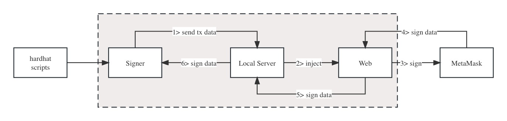

# hardhat-metamask-connector

Hardhat MetaMask Connector is a tool to connect your MetaMask wallet with your Hardhat development environment. Deploy and interact with smart contracts using your MetaMask wallet without exposing your mnemonic or private key in code.

## Features

- Connect to MetaMask directly from Hardhat scripts
- Deploy contracts using your MetaMask wallet
- Sign transactions through MetaMask UI
- Support for multiple networks (localhost, Polygon, Ethereum, etc.)
- Automatic network switching
- No private keys in code - ever!

## Install

```bash
npm install @web3camp/hardhat-metamask-connector
```

or

```bash
yarn add @web3camp/hardhat-metamask-connector
```

## Quick Start

> **⚠️ Important**: You **must** call `await signer.getAddress()` after getting the signer. This is what triggers the browser to open and establishes the MetaMask connection!

### 1. Import the connector

```javascript
import { MetamaskConnector } from "@web3camp/hardhat-metamask-connector";
```

or

```javascript
const { MetamaskConnector } = require("@web3camp/hardhat-metamask-connector");
```

### 2. Basic Usage

```javascript
import { ethers } from "hardhat";
import { MetamaskConnector } from "@web3camp/hardhat-metamask-connector";

async function main() {
  // Initialize the connector
  const connector = new MetamaskConnector();

  // Get signer from MetaMask
  const signer = await connector.getSigner();

  // IMPORTANT: You MUST call getAddress() to trigger the browser to open
  // and wait for MetaMask connection. This is a required step!
  const signerAddr = await signer.getAddress();
  console.log("Signer Address:", signerAddr);

  // Now you can deploy contracts using MetaMask
  const MyContract = await ethers.getContractFactory("MyContract");
  const contract = await MyContract.connect(signer).deploy();
  await contract.waitForDeployment();

  console.log("Contract deployed to:", await contract.getAddress());

  // Close the connector when done
  connector.close();
}

main();
```

### 3. Run your script

```bash
# For localhost network
npx hardhat run scripts/deploy.ts --network localhost

# For Polygon network
npx hardhat run scripts/deploy.ts --network polygon

# For any configured network
npx hardhat run scripts/deploy.ts --network <network-name>
```

## How It Works

1. **Initialize connector**: `new MetamaskConnector()` creates a local web server (default port 8989)
2. **Get signer**: `await connector.getSigner()` returns a signer object
3. **Trigger browser**: **`await signer.getAddress()`** opens the browser and waits for MetaMask connection
4. **Connect MetaMask**: Click "Connect to MetaMask" in the browser and approve the connection
5. **Network switch**: MetaMask automatically switches to the correct network
6. **Sign transactions**: Approve transactions in MetaMask as they come
7. **Script continues**: Your Hardhat script receives the signed transactions

> **Important**: You **must** call `await signer.getAddress()` before using the signer. This triggers the browser to open and establishes the MetaMask connection. Without this call, the browser won't open!

## Configuration

### Custom Server Port

```javascript
// Use a custom port (default is 8989)
const connector = new MetamaskConnector(9000);
```

### Network Configuration

Configure networks in your `hardhat.config.ts`:

```typescript
import { HardhatUserConfig } from "hardhat/config";

const config: HardhatUserConfig = {
  networks: {
    localhost: {
      url: "http://127.0.0.1:8545",
      chainId: 31337,
    },
    polygon: {
      url: "https://polygon-mainnet.infura.io/v3/YOUR_INFURA_KEY",
      chainId: 137,
    },
    mainnet: {
      url: "https://eth.llamarpc.com",
      chainId: 1,
    }
  }
};

export default config;
```

**Note**: You don't need to specify `accounts` when using MetaMask Connector - that's the whole point!

## Complete Example

See the `example` folder for a full working example:

```bash
cd example
npm install
npx hardhat node  # In one terminal
npx hardhat run scripts/deploy.ts --network localhost  # In another terminal
```

## Browser Console Logs

When using the connector, you'll see helpful logs in the browser console (F12):

- `Current MetaMask chainId: 0x89` - Shows the connected network
- `Switched to chainId: 0x89` - Confirms network switch
- `Transaction sent: 0x123...` - Transaction hash
- `Verify at: https://polygonscan.com/tx/0x123...` - Block explorer link

## Troubleshooting

### Browser doesn't open automatically
- **Make sure you called `await signer.getAddress()`** - this is what triggers the browser to open
- If you still have issues, manually open the URL shown in the console (e.g., `http://localhost:8989/send-tx`)

### Wrong network
- The connector will prompt MetaMask to switch to the correct network
- Make sure to approve the network switch in MetaMask

### Transaction not appearing on block explorer
- Check the browser console for the chainId - ensure it matches your expected network
- Verify MetaMask is on the correct network

### Port already in use
- Change the port: `new MetamaskConnector(9000)`
- Or kill the process using port 8989

## Supported Networks

The connector automatically shows block explorer links for:
- Ethereum Mainnet (etherscan.io)
- Polygon (polygonscan.com)
- Optimism (optimistic.etherscan.io)
- Arbitrum (arbiscan.io)
- Base (basescan.org)
- Any Hardhat local network

# The idea



# To be continue

- [x] Inject signer to ethers  
- [x] Optimize the launch of the browser  
- [x] Optimize the webpage  
- [ ] Add support of other wallets
    - [ ] Coinbase Wallet
    - [ ] OKX Wallet
    - [ ] WalletConnect

## Special thanks
[hardhat-metamask-client](https://github.com/deusfinance/Hardhat-metamask-client)
