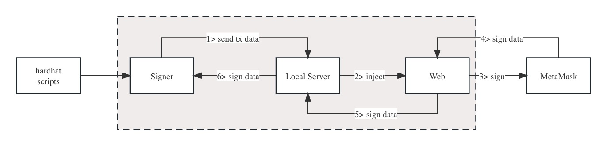

# hardhat-metamask-connector

Hardhat Metamask Connector is a tool to connect your metamask with your hardhat development environment, and let you say bye-bye to exposing your mnemonic or private key.

# Install

`npm install @web3camp/hardhat-metamask-connector` 

or 

`yarn @web3camp/hardhat-metamask-connector` to install the npm package.

# Usage
```
const { MetamaskConnector } = require("@web3camp/hardhat-metamask-connector");
```
or

```
import { MetamaskConnector } from "@web3camp/hardhat-metamask-connector";
```

```
let connector = new MetamaskConnector();
let signer = await connector.getSigner();
let signerAddr = await signer.getAddress();
```

# Test

There is a sample test hardhat project, just run `npm install` and `npx hardhat run scripts/deploy.ts` to make test in `example` folder.

# The idea



# To be continue

- [x] Inject signer to ethers  
- [ ] Optimize the launch of the browser  
- [x] Optimize the webpage  
- [ ] Add support of other wallets
    - [ ] Coinbase Wallet
    - [ ] OKX Wallet
    - [ ] WalletConnect

## Special thanks
[hardhat-metamask-client](https://github.com/deusfinance/Hardhat-metamask-client)
